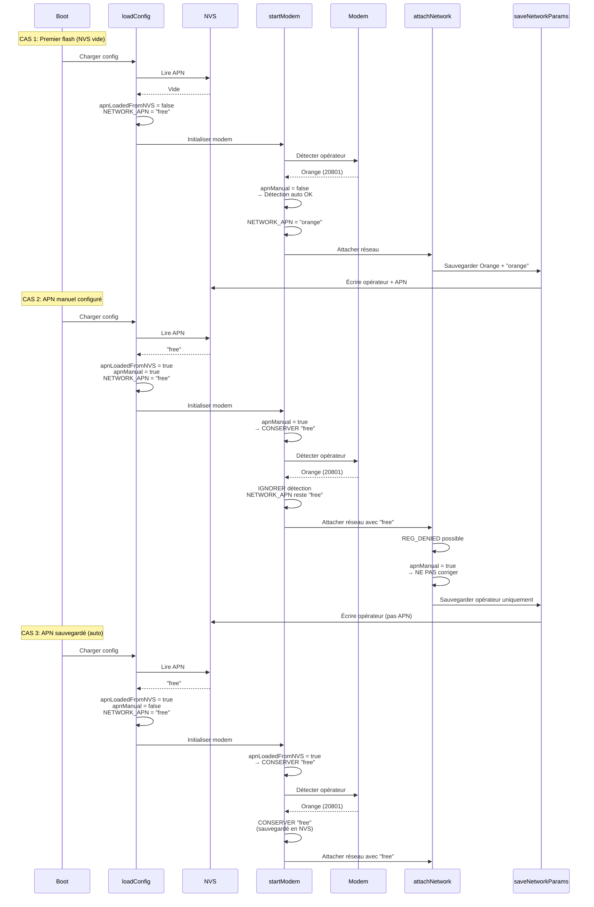

# Schéma de la Logique APN - Firmware OTT

## Vue d'ensemble de la hiérarchie de décision

```mermaid
flowchart TD
    Start([Démarrage Firmware])
    Start --> LoadConfig[loadConfig<br/>Charge APN depuis NVS]
    LoadConfig --> CheckNVS{APN en NVS?}
    CheckNVS -->|Oui| SetLoaded[apnLoadedFromNVS = true<br/>NETWORK_APN = APN_NVS]
    CheckNVS -->|Non| SetDefault[apnLoadedFromNVS = false<br/>NETWORK_APN = OTT_DEFAULT_APN]
    SetLoaded --> StartModem
    SetDefault --> StartModem[startModem<br/>Initialisation modem]
    
    StartModem --> CheckManual{apnManual<br/>= true?}
    
    CheckManual -->|OUI| KeepManual[🔒 NIVEAU 1: APN MANUEL<br/>CONSERVER NETWORK_APN<br/>JAMAIS modifier]
    KeepManual --> UseAPN[Utiliser NETWORK_APN]
    
    CheckManual -->|NON| CheckLoaded{apnLoadedFromNVS<br/>= true?}
    
    CheckLoaded -->|OUI| CheckOperatorChange{Changement<br/>d'opérateur<br/>détecté?}
    CheckOperatorChange -->|OUI| UseNewAPN[🔧 NIVEAU 2: Détecter<br/>nouveau opérateur<br/>→ Utiliser son APN]
    CheckOperatorChange -->|NON| KeepSaved[🔒 NIVEAU 2: APN SAUVEGARDÉ<br/>CONSERVER NETWORK_APN<br/>sauvegardé]
    UseNewAPN --> UseAPN
    KeepSaved --> UseAPN
    
    CheckLoaded -->|NON| DetectSIM[🔍 NIVEAU 3: DÉTECTION AUTO<br/>Détecter carte SIM/opérateur]
    DetectSIM --> HasSIM{Carte SIM<br/>détectée?}
    HasSIM -->|OUI| UseSIMAPN[Utiliser APN de la<br/>carte SIM]
    HasSIM -->|NON| HasOperator{Opérateur<br/>réseau détecté?}
    HasOperator -->|OUI| UseOperatorAPN[Utiliser APN recommandé<br/>pour opérateur]
    HasOperator -->|NON| UseDefault[Utiliser APN<br/>par défaut]
    UseSIMAPN --> UseAPN
    UseOperatorAPN --> UseAPN
    UseDefault --> UseAPN
    
    UseAPN --> AttachNetwork[attachNetworkWithRetry<br/>Attachement réseau]
    AttachNetwork --> CheckRegDenied{REG_DENIED?}
    
    CheckRegDenied -->|OUI| CheckManualDenied{apnManual<br/>= true?}
    CheckManualDenied -->|OUI| NoCorrection[🔒 NE PAS corriger<br/>Logger erreur uniquement]
    CheckManualDenied -->|NON| CorrectAPN[🔧 Corriger APN si<br/>nécessaire]
    CorrectAPN --> RetryAttach[Nouvelle tentative<br/>attachement]
    NoCorrection --> ConnectData
    RetryAttach --> ConnectData[connectData<br/>Connexion GPRS]
    
    CheckRegDenied -->|NON| ConnectData
    
    ConnectData --> CheckManualConnect{apnManual<br/>= true?}
    CheckManualConnect -->|OUI| UseOnlyManual[Utiliser SEULEMENT<br/>NETWORK_APN<br/>Pas de fallback]
    CheckManualConnect -->|NON| UseFallback[Utiliser NETWORK_APN<br/>+ fallbacks si échec]
    UseOnlyManual --> SaveParams
    UseFallback --> SaveParams[saveNetworkParams<br/>Sauvegarder opérateur/APN]
    
    SaveParams --> CheckManualSave{apnManual<br/>= true?}
    CheckManualSave -->|OUI| SkipSave[Ne pas sauvegarder<br/>l'APN détecté]
    CheckManualSave -->|NON| CheckOperatorChangeSave{Changement<br/>d'opérateur<br/>OU<br/>apnLoadedFromNVS = false?}
    CheckOperatorChangeSave -->|OUI| UpdateAPN[Mettre à jour<br/>NETWORK_APN]
    CheckOperatorChangeSave -->|NON| KeepCurrentAPN[Conserver APN<br/>actuel]
    UpdateAPN --> SaveNVS
    KeepCurrentAPN --> SaveNVS[saveConfig<br/>Sauvegarder en NVS]
    SkipSave --> SaveNVS
    
    SaveNVS --> End([Fonctionnement normal])
    
    style KeepManual fill:#ff6b6b,stroke:#c92a2a,color:#fff
    style KeepSaved fill:#ffd93d,stroke:#f59f00,color:#000
    style DetectSIM fill:#51cf66,stroke:#2f9e44,color:#fff
    style NoCorrection fill:#ff6b6b,stroke:#c92a2a,color:#fff
    style CorrectAPN fill:#74c0fc,stroke:#1971c2,color:#fff
    style UseOnlyManual fill:#ff6b6b,stroke:#c92a2a,color:#fff
```



## Diagramme de séquence - Boot avec différents cas



## Matrice de décision simplifiée

| État initial | apnManual | apnLoadedFromNVS | Opérateur détecté | Action finale |
|--------------|-----------|------------------|-------------------|---------------|
| **Boot premier flash** | `false` | `false` | Orange | → Utiliser "orange" |
| **Boot premier flash** | `false` | `false` | Free | → Utiliser "free" |
| **APN manuel "free"** | `true` | `true` | Orange | → **Conserver "free"** 🔒 |
| **APN auto "orange"** | `false` | `true` | Orange | → Conserver "orange" |
| **APN auto "free"** | `false` | `true` | Orange | → **Conserver "free"** 🔒 |
| **Changement SIM** | `false` | `true` | Free (différent) | → Utiliser "free" |
| **Changement SIM** | `true` | `true` | Free (différent) | → **Conserver APN manuel** 🔒 |
| **REG_DENIED** | `true` | `true` | - | → **NE PAS corriger** 🔒 |
| **REG_DENIED** | `false` | `true` | Orange | → Corriger si nécessaire |

## Les 3 niveaux de priorité

### 🔒 NIVEAU 1 : APN MANUEL (priorité absolue)
```
┌─────────────────────────────────────────┐
│  apnManual = true                       │
│  ┌───────────────────────────────────┐  │
│  │ CONSERVER NETWORK_APN tel quel    │  │
│  │ JAMAIS modifier                   │  │
│  │ JAMAIS détection auto             │  │
│  │ JAMAIS correction REG_DENIED      │  │
│  └───────────────────────────────────┘  │
└─────────────────────────────────────────┘
```

### 🔒 NIVEAU 2 : APN SAUVEGARDÉ EN NVS
```
┌─────────────────────────────────────────┐
│  apnManual = false                      │
│  apnLoadedFromNVS = true                │
│  ┌───────────────────────────────────┐  │
│  │ CONSERVER NETWORK_APN sauvegardé  │  │
│  │ SAUF si changement d'opérateur    │  │
│  │ (changement de carte SIM)         │  │
│  └───────────────────────────────────┘  │
└─────────────────────────────────────────┘
```

### 🔍 NIVEAU 3 : DÉTECTION AUTOMATIQUE
```
┌─────────────────────────────────────────┐
│  apnManual = false                      │
│  apnLoadedFromNVS = false               │
│  ┌───────────────────────────────────┐  │
│  │ Détecter opérateur/SIM            │  │
│  │ Utiliser APN recommandé           │  │
│  │ Priorité: SIM > Réseau > Défaut   │  │
│  └───────────────────────────────────┘  │
└─────────────────────────────────────────┘
```

## Points d'entrée de modification APN

```
┌──────────────────────────────────────────────────────────────┐
│                   POINTS D'ENTRÉE                            │
├──────────────────────────────────────────────────────────────┤
│                                                              │
│  1. loadConfig()                                             │
│     └─ Charge depuis NVS ou valeur par défaut               │
│        ⚡ Définit apnLoadedFromNVS                           │
│                                                              │
│  2. startModem()                                             │
│     └─ Détection auto opérateur/SIM                         │
│        ⚠️ Peut modifier APN (si apnManual=false)            │
│                                                              │
│  3. attachNetworkWithRetry()                                │
│     └─ Correction si REG_DENIED                             │
│        ⚠️ Peut modifier APN (si apnManual=false)            │
│                                                              │
│  4. connectData()                                            │
│     └─ Liste fallback APN                                   │
│        ✅ Ne modifie pas NETWORK_APN                        │
│                                                              │
│  5. UPDATE_CONFIG (USB/OTA)                                 │
│     └─ Configuration manuelle                               │
│        ⚡ Définit apnManual = true                           │
│                                                              │
│  6. RESET_CONFIG                                             │
│     └─ Réinitialisation                                     │
│        ⚡ Définit apnManual = false                          │
│                                                              │
│  7. saveNetworkParams()                                     │
│     └─ Sauvegarde opérateur/APN détectés                    │
│        ⚠️ Peut modifier APN (si apnManual=false)            │
│                                                              │
└──────────────────────────────────────────────────────────────┘
```

## Règle d'or

> **"Si l'utilisateur a configuré un APN (manuellement ou via NVS), le conserver sauf changement explicite de carte SIM ET apnManual=false"**

## Cas limites gérés

### Cas limite 1 : APN par défaut sauvegardé = valeur par défaut
- **Exemple** : APN "free" sauvegardé, valeur par défaut = "free"
- **Solution** : `apnLoadedFromNVS` distingue les deux situations
- ✅ **Résolu**

### Cas limite 2 : Changement de carte SIM
- **Détection** : Comparaison `DETECTED_OPERATOR` vs opérateur actuel
- **Action** :
  - Si `apnManual=true` → conserver APN
  - Si `apnManual=false` → utiliser APN du nouvel opérateur

### Cas limite 3 : REG_DENIED avec APN manuel
- **Problème** : Le réseau refuse mais APN est manuel
- **Solution** : Ne pas corriger automatiquement, seulement logger
- ✅ **Corrigé**
